# 東京都立大学の学生アカウントでMicrosoft Teamsのチームに参加する方法

> 単にTeamsのオンライン講義に参加するだけの場合は『[前提](#前提)』を読んだら『[学生の操作](#学生の操作)』の章へスキップしてお読みください。

## 前提

東京都立大学ではコロナウイルスの影響で2020年度前期の講義がオンライン化されましたが、大学は『Zoom』をオンライン講義に使うという事で、準備を進めています。
『Zoom』は便利なツールではありますが、これでオンライン講義をすると、一般的に言われているセキュリティー上の懸念に目を瞑ったとしても、受講者のアカウントが、大学のアカウントと紐づいていないなど、オンライン講義に適したツールであるとは言えません。他にもオンライン会議ツールとしては『Micsoroft Teams』が話題です。オンライン会議システムの機能としては、何を使っても殆ど同じで、好みの問題かもしれませんが、TeamsはSlackとZoomが合わさったようなツールであり、若干のアドバンテージが有るように思います。

実は、大学からは一切アナウンスがありませんが、東京都立大学の学生は、大学のアカウントを使ってMicrosoft Teamsを使えます。
これは、学生メールがMicrosoft 365を使っているからです。
公式にはメール(とOfficeのダウンロード？)のみしか使っていませんが、アカウントとしてはMicrosoft 365の様々なツールが利用可能です。

一方の、教員はMicrosoft 365のアカウントを持っていません。持っていたら、簡単にTeamsでフルセットのオンライン教育システムが使えるのですが・・・。

でも、実は.ac.jpのメールアドレスがあれば、個人でアカデミックライセンス(無料)を取得する事ができます。それだけでなく、5人の教員＋15人の学生アカウントを持った、組織を無料で作る事が出来ます。ちょうど研究室に良いサイズなので、私は研究室内でこれを使っていましたが、これには、任意のMicrosoftアカウントを持ったゲストユーザを招待する機能があります。@hotmail.comや@live.com等のメールを持つユーザを呼べる機能ですが、大学のメールアドレス@ed.tmu.ac.jpがMicrosoftアカウントですので、そのユーザを簡単に追加する事が出来ます。

そこで、この文書では、Teamsでオンライン講義をする、あるいは大学推奨のZoomに加えて補助的に使用する事を目的として、教員が個人的に作った**Microsoft 365のアカデミック版サービス(無料でも可)で運営するMiscrosoft Teamsに、都立大アカウントを使っている学生をゲストとして招待する方法**を記します。

なお、大学が急遽Zoomの有料アカウントを全教員分買っていますので、もちろんTeamsを使わずに、Zoomのみでオンライン講義をする事は全く問題なく可能です。ただしTeamsはZoomを使うのに比べて、以下の利点があります。

- **確実に受講学生のみに対して講義をする事ができます**
    - Zoomの場合は、誰でも接続できる会議URLを使うので、URL流出のリスクがあります
- **大学アカウントと紐づけられています**
    - 学生のMicrosoftアカウントは大学メールアドレスに紐づけられているため、講義のオンライン会議に参加している人が誰か分かります
- **Zoombombingを避けられます**
    - 受講生のみを講義のチームに招待する事で、匿名ユーザによるいたずらの可能性がありません
- **１つのツールで完結します**
    - 会議をZoom、課題提出がKibaco、そしてメールにて質疑応答、あるいは独自にSlackを立ち上げる等、バラバラのシステムをTeamsでは統合できます
- **プレゼンフレンドリー**
    - 講義資料をPowerPointで作成している場合、オンラインプレゼンテーション機能が利用できます。これは「画面の共有」によるプレゼンテーションよりも、通信量の劇的な減少が期待できます。
- **Zoomにお布施をする必要がありません**
    - Microsoft 365 A1ライセンスは無料です (Teamsのライブイベントという機能を使いたい場合のみ月270円のA3ライセンスを買う必要があります)
    - (都立大では、すでに大学が全教員分のZoomの有料ライセンスを買いましたので、Zoomを使うとしても個々の教員の出費はありません)

現在、大学では教員全員に『Zoom』の有料アカウントを作成しましたが、学生のアカウント管理はせず、誰でも会議に参加できるURLを、学生限定ページにて、公開するという方法を推奨しています。この方法でも会議は可能ですが、受講学生以外もそのURLを閲覧できますし、これが「秘密のURL」である事を認識せず、不慮の事故でURLが流出してしまう危険性があります。また、Zoomのアカウントと大学のアカウントは関連付けられていないため、各学生は **任意の"アカウント"** を使い、 **任意の"ハンドルネーム"** を設定できます。たとえ「ハンドルネームを本名としてください」というルールを定めたとしても、姓名間のスペースの有無や旧字体の扱い等、フォーマットを揃える事は難しいため、成績管理システムに登録された名前と突き合わせる事は、殆ど手動で行う事となり、100人を超える講義では、受講生の管理が災害的な困難さになりえます。Teamsの利用がベストかは分かりませんし、講義が始まってみると、色々と問題も出てくるかもしれませんが、忘備録として、Teamsを講義に使う記録に残します。

なお、都立大のような環境、すなわち **Microsoft 365のアカウントを全学生が持っているにも関わらず、教員はMicrosoft 365のアカウントを持っておらず、急なオンライン講義にて開講する事態に際して、大学はMicrosoft 365のアカウントではなく、なぜかZoomの有料アカウントを買って教員に配布し、学生にはZoomでの講義に匿名参加させる環境** という、完全に<s>支離滅裂</s>**ニッチ**な環境をターゲットとしてTeamsを活用するためのHow-Toですので、一般的には役に立たないかもしれませんが、Teamsは無料アカウントでも使えますので、学生も教員もMicrosoft365アカウントを持っていないという環境においては何らかの参考になるかもしれません。

都立大の環境において、講義にTeamsを取り入れる場合の操作フローは次の通りです。 [教員操作](#user-content-教員の操作)

1. [教員操作](#教員の操作)
   1. 教員がMicrosoft 365 A1アカウントを取得
   1. Teamsで講義毎にチームを作成
   1. Kibacoで受講学生のxxxx@ed.tmu.ac.jpのメール一覧を取得
   1. そのメールアドレスをチームに招待する
   1. 教員が会議をスケジュールする
   1. 講義の開始
1. [学生操作](#学生の操作)
   1. Microsoft Teamsアプリをインストール
   1. 招待メールのリンクからチームにサインイン
   1. オンライン講義の受講
   
 では実際に、操作をスクリーンショットを使って紹介します。参加する学生の皆さんは[学生の操作](#学生の操作)のみを見れば十分ですが、サークル等で利用する場合は、教員側の操作も参考になると思います。

## 教員の操作 

### 1. A1アカウントの取得

無料のA1アカウントを取得するには、つぎの公式ガイドが分かりやすくまとまっています。このガイドの通りに申請すると、教員アカウント5個、学生用アカウント15個を取得できます。オンライン講義を行うには、教員アカウント1個のみ使用します。

https://download.microsoft.com/download/a/6/4/a64072c9-2c65-4205-bf1e-b3a5be486633/Office365_A1_Startup_Guide.pdf

### 2. Teamsで講義毎にチームを作成

* **サイドバーの『チーム』から、チームを作成**

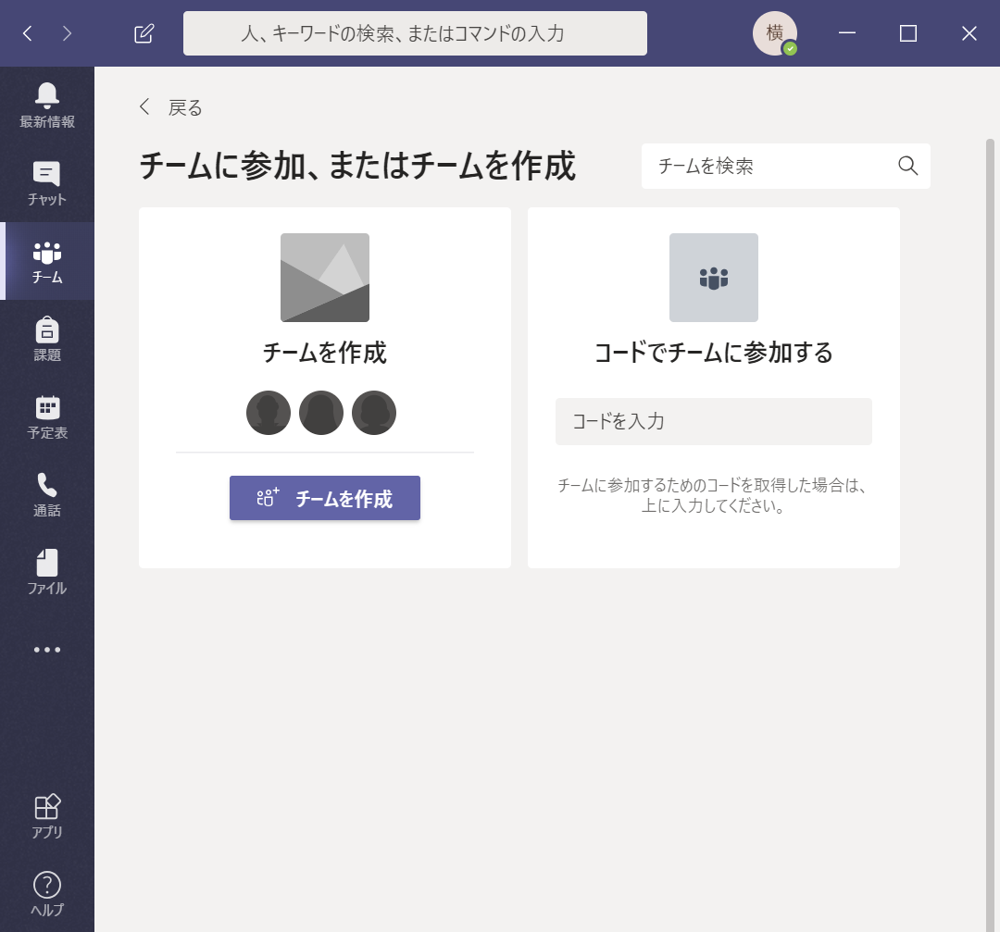

* **チーム形式を選択する画面が出てくるので『クラス』を選択**

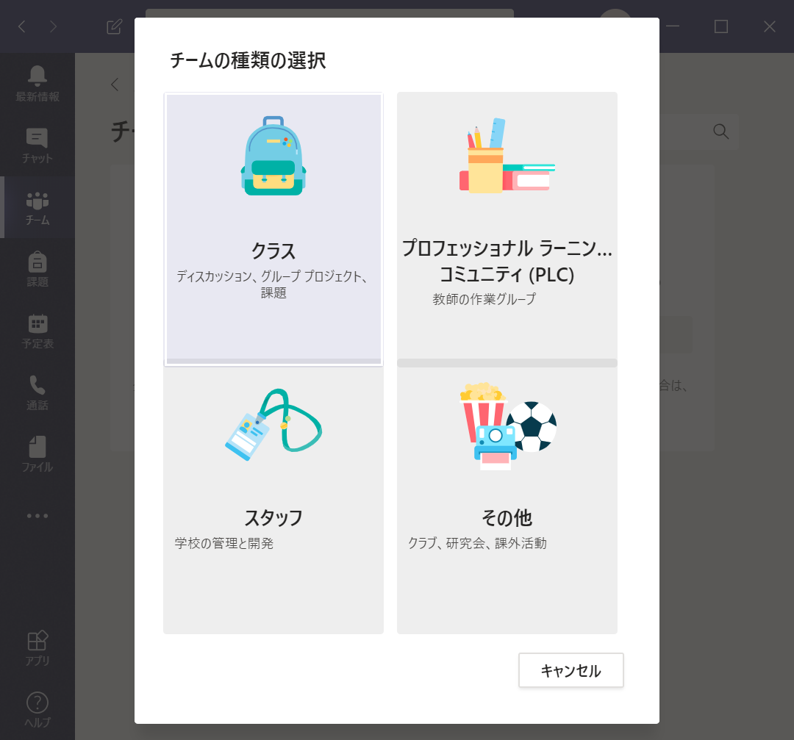

* **チーム名を入力する画面が出てくるので「講義名+年」という形で講義のためのチームを作成 (例:「情報論理学2020」)**

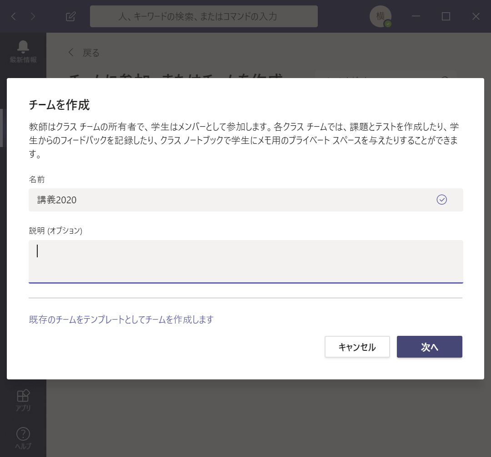

* **次にメンバーを追加する画面が出てくるが、この時点では『スキップ』**
    * ここで学生を追加する事も可能ですが、受講者が大勢の場合は、先にチームを作成してあとでゆっくり作成する事をお勧めします

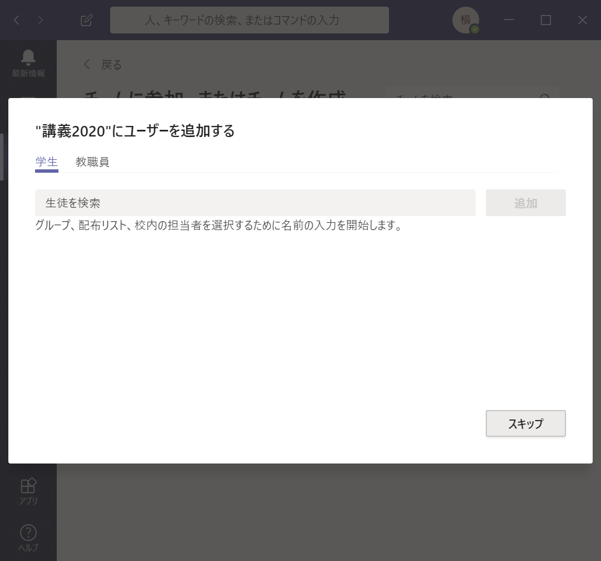

* **チームが作成され、メイン画面がでてくる**

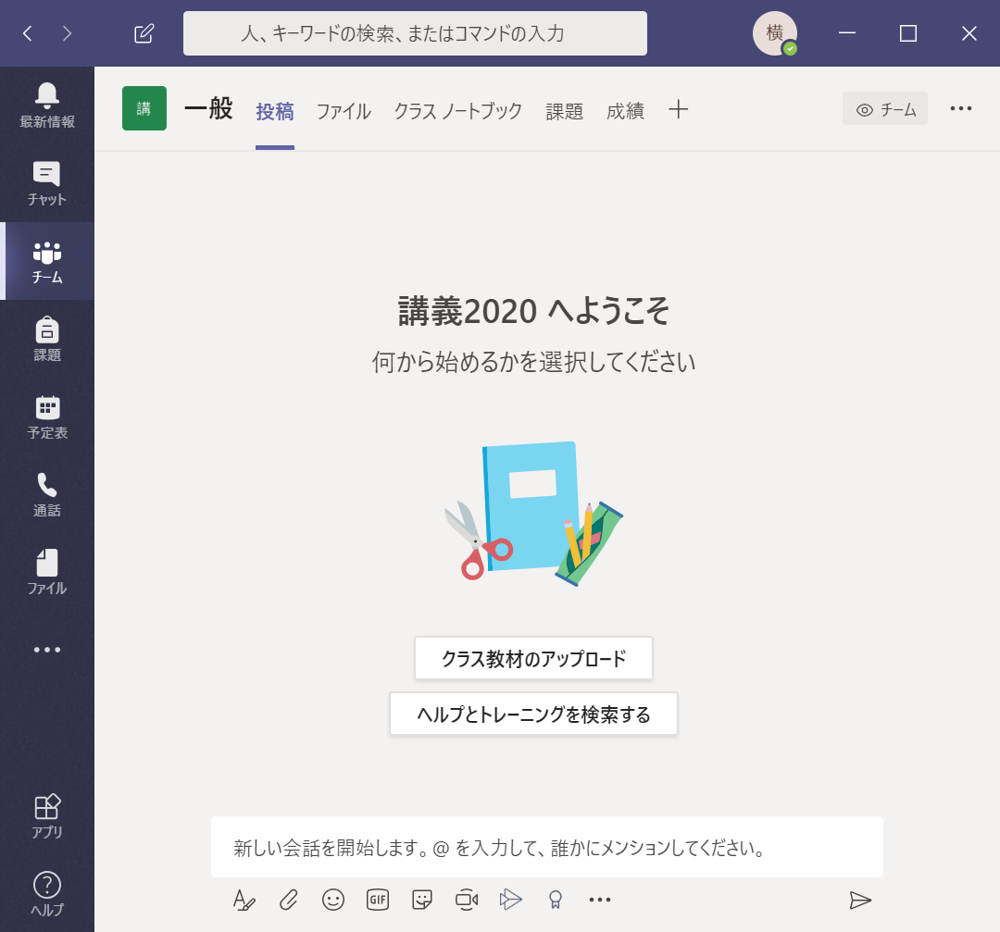

* 環境設定は完了です。次に受講学生を追加していきましょう。

### 3. 学生のメールアドレスをチームに招待

* **設定メニューから『メンバーの追加』をクリック**

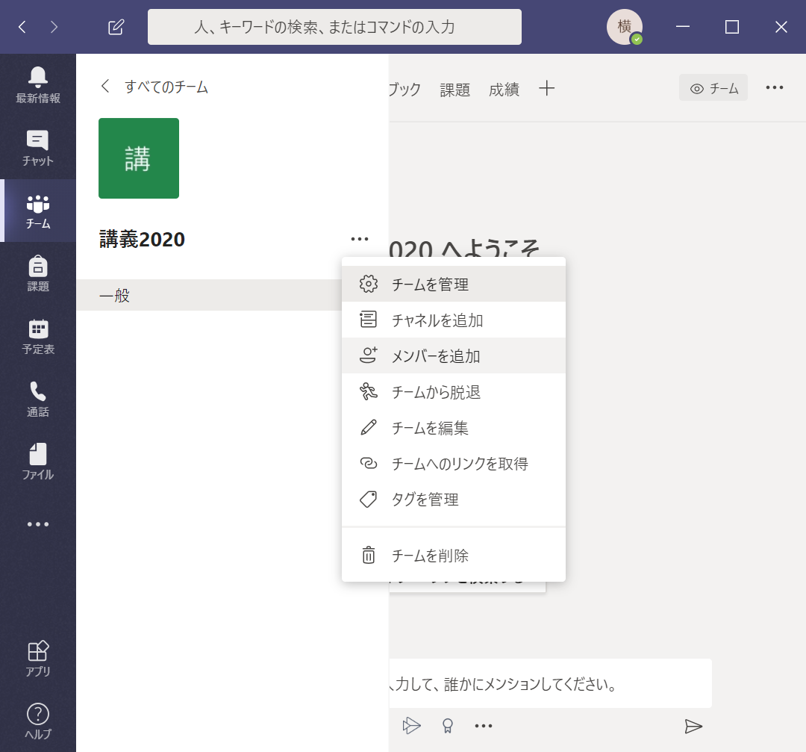

* **次に[kibaco](https://kibaco.tmu.ac.jp/)の各講義のタブの『名簿』から学生のメールアドレスのリストを得ます。**
* **そして、そのアドレスをメンバーとして１つ１つ追加します。**
    * 受講生が多いとこれがめんどくさいので、今、バルクロードする方法を探しています。PowerShellがMicrosoft365に接続できるそうなので、それでで出来るかな？
    
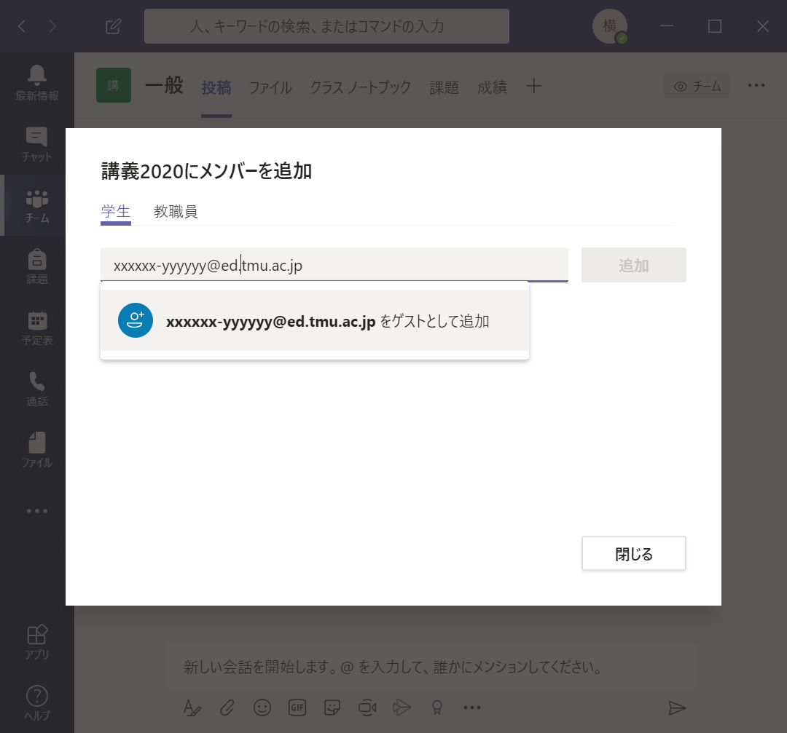

* **これで招待メールが学生の大学メールに送られます。そのメールに基づいて学生がチームにサインインすると、メンバーリストに追加されます。**

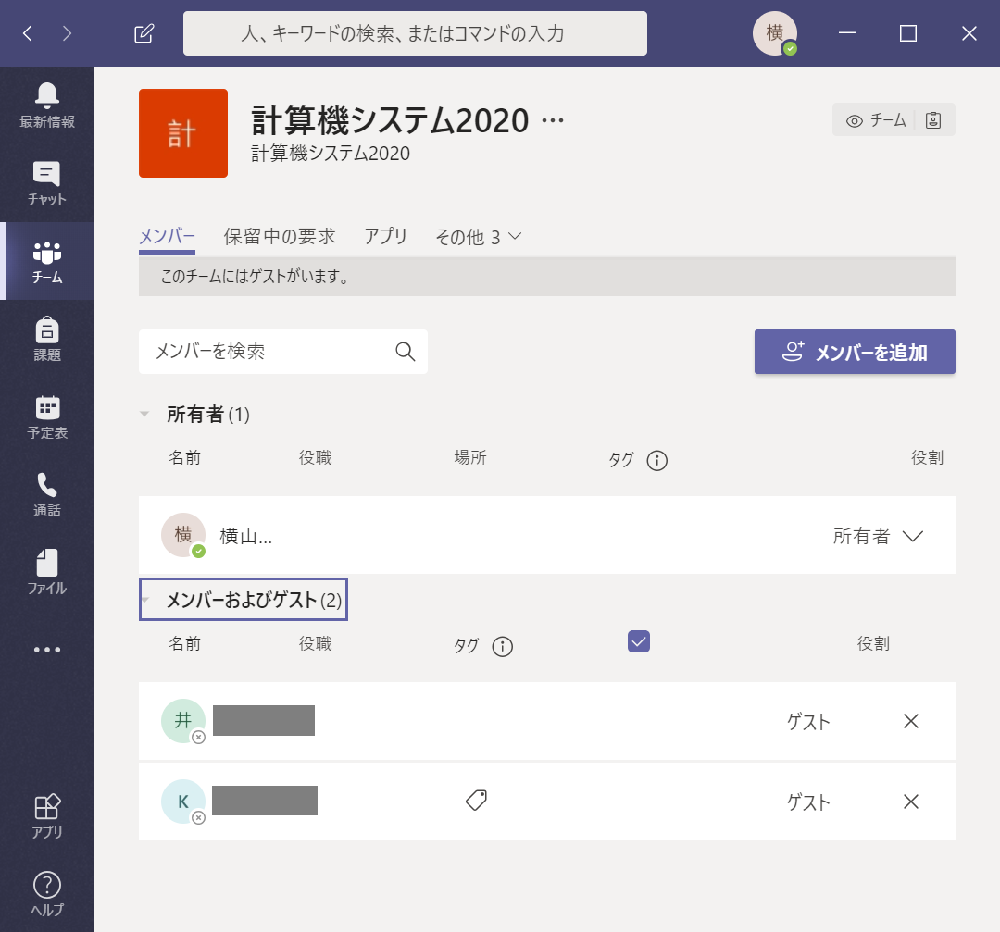

* **これでいつでもオンライン講義を行う準備が整いました。**

### 5. 教員が会議をスケジュールする

* **オンライン講義の為の会議を立ち上げます。左側のサイドバーの『予定表』をクリックしてカレンダーを表示してください。**
* **ページ右上の『新しい会議』をクリック**

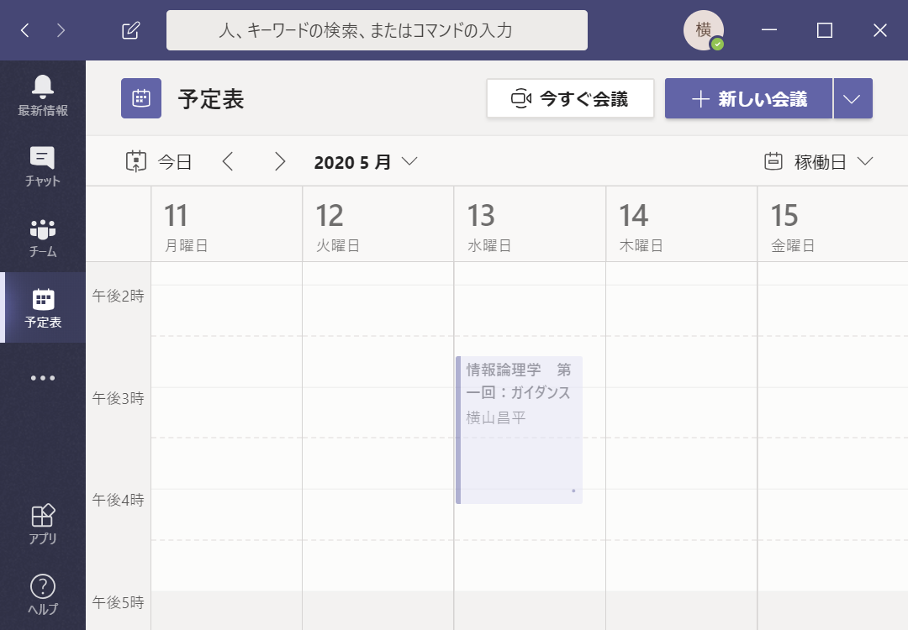

* **講義の各回分の会議の予定を作成しましょう**
    * 会議のタイトルは講義名とその回の主題を入力すると良いでしょう。
    * 会議の開始・終了時刻はそのコマぴったりで構いません。(早く始めたり、おそく終わったりが可能です)
    * 会議に講義チームの「一般」チャンネルを指定しましょう。
 
 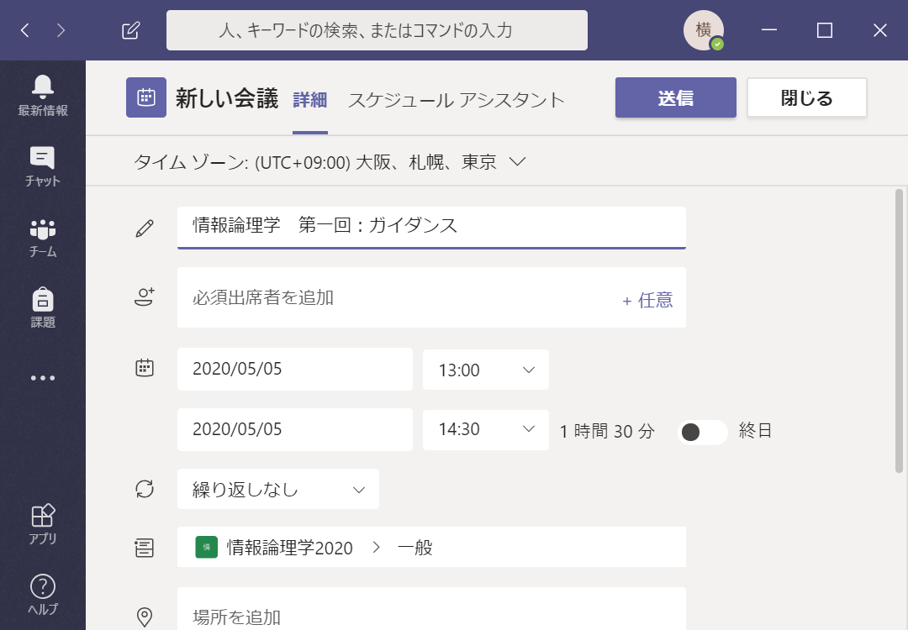
 
 * **これでカレンダーに講義が掲載されました**
     * 受講者(チームメンバー)にも見える様になっています。

### 6. オンライン講義の開始

* **カレンダーに登録された会議は、指定したチームのチャンネルにも表示されています**

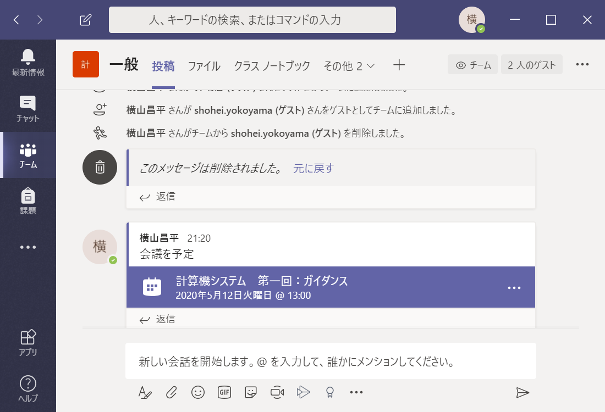

* **これをクリックして詳細画面から「参加」をクリックすると会議を開始できます。**
    * 沢山の講義を先に登録してしまうと、チャンネルに沢山の会議が並ぶ事になり、学生がどれに参加してよいのか分からなくなる可能性がありますので、最新の一件のみを追加していくのが良いと思います。 (カレンダーから参加する事もできるので、そっちからだと迷わないかもしれませんが)
    
### 6(おまけ). ライブイベントでオンライン講義をする場合

Teamsでは会議の他に『ライブイベント』という機能があります。これは『YouTube Live』などのライブ配信と同じ機能で、会議システムとの違いは、参加者間の双方向性があるか、ないかです。大学の講義を考えると、オンライン会議システムでは、学生が慣れていないと(もちろん教員も慣れていないと)、マイクをミュートし忘れたりして、誰かの環境音が聴講学生全員に聞こえてしまい、講義にならない事があります。ライブ配信の場合は、音声・画像を送れるのは、予め定められた発表者だけとなり、聴講者は基本的には聞くだけになります。ただし、テキストチャットをしたり、会議配信者が準備したQ&Aに応えたりと、大教室講義として必要最低限な双方向性は担保できるように思います。

ただし、現時点でのTeamsライブイベントは会議に比べて一つだけ大きな弱点があります。会議の方ではPowerPointプレゼンテーションの画面共有が、ファイルベースで行われます。つまり、クラウドのOneDrive上に保存されたpptxファイルを全員がダウンロードして表示し、発表者から聴講者へは、スライド画面そのものではなく、何ページを表示していかという最低限の情報のみ送られます。これはZoomや他の会議室にない大きなアドバンテージです。なぜならば、スライド画面そのものを配信する場合、FullHDぐらいの動画が、発表者から聴講者へ送られるからです。一方で、Teams会議の仕組みは、「いまスライドめくってxページになったよ」という情報しか、おそらく送られていません。これにより通信量の大幅な削減が期待できますし、聴講者はスライドのpptxそのものを持っていますので、講演者の表示とは関係無く、前のページにもどったり、先読みしたりする事ができます。これがTeams会議の大きな利点だと思うのですが、ライブイベントの方はこれが残念ながら使えません。

通信量を気にしないでよければ、ライブイベントは、聴講者の不慮な音声や画像によるインタラプトが発生しえないという点で、大きな利点もあります。

* **『予定表』画面の右上『新しい会議』のドロップダウンメニューを引き出し『ライブイベント』をクリックします**

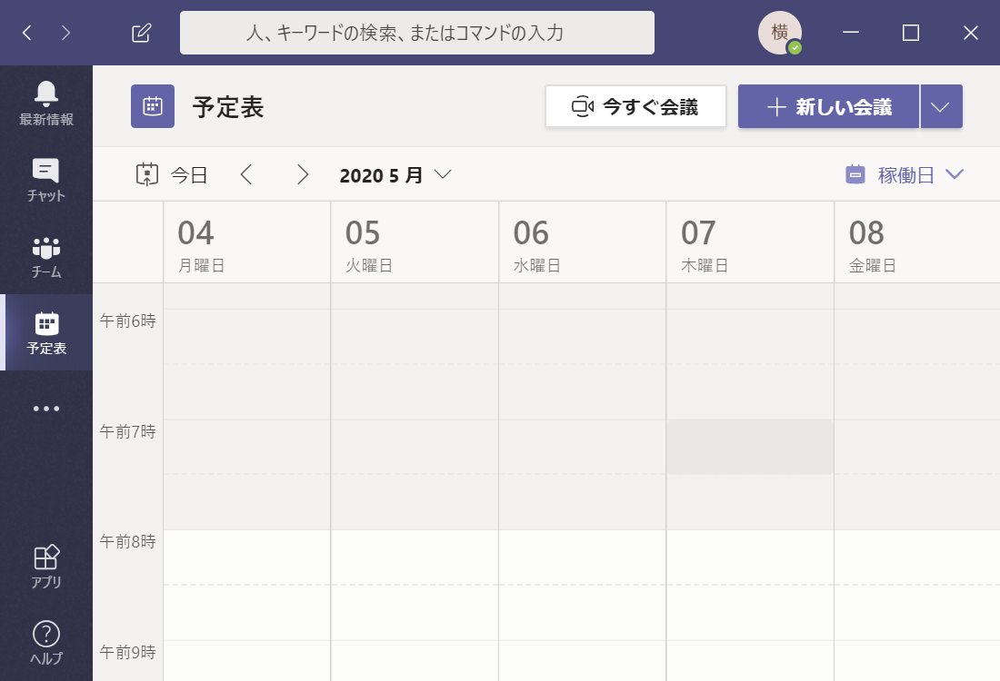

* **ライブイベントの作成画面が出てくるので、講義名と時間帯を入力しましょう**

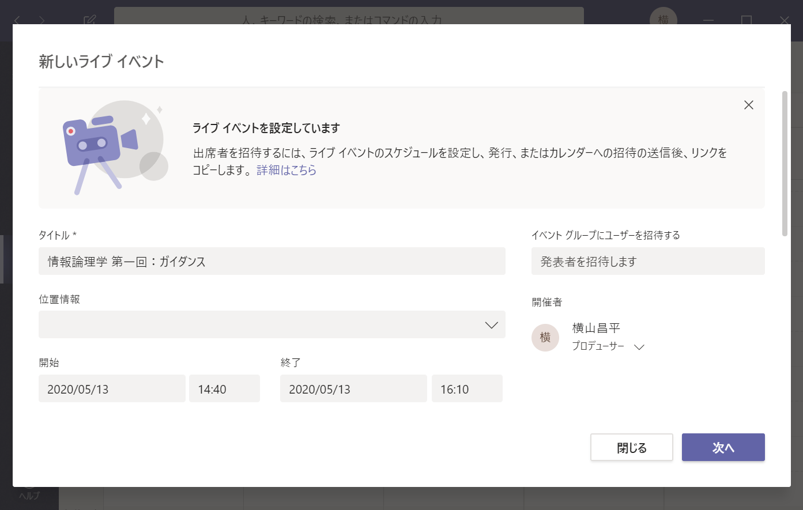

* **アクセス許可の画面が出てくるので『ユーザとグループ』を選択**
* **また『アクセス許可を与える』のテキストフィールどに講義のチーム名を入力します**

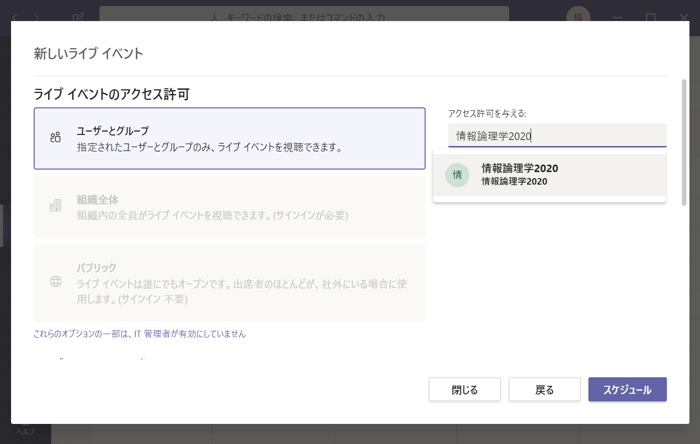

* **これで『スケジュール』ボタンをクリックしたらライブイベントの予定が作成されます**

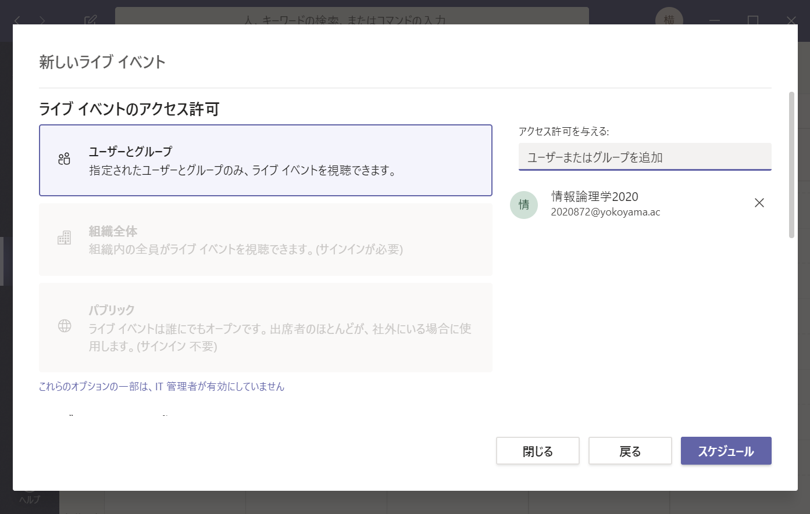

* **作成されました。『出席者のリンクを取得する』からイベントのURLを控えておきましょう。**

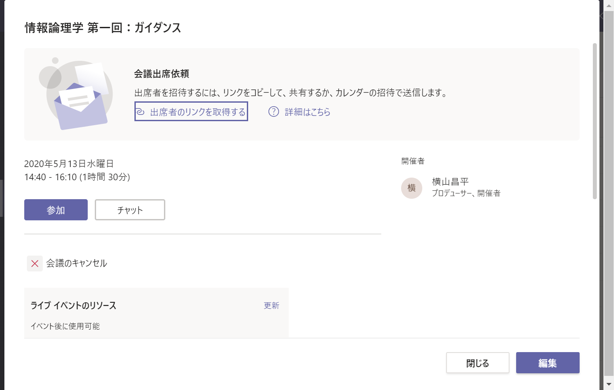

* **会議と異なり、参加のためのURLが自動で会議チームのスレッドに投稿されないので、自分で投稿しましょう**
* **なお、チームメンバーしか視聴できない設定ですので、このURLが流出しても問題ありません(YouTube Liveに比べて大きな利点)**
   * kibacoに直接貼っても良いですし、公開されたWebページに貼っても安全です。

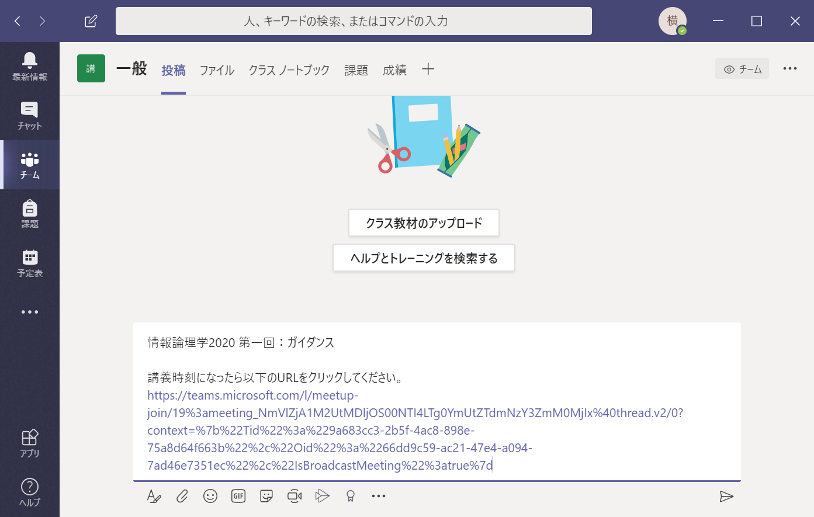

* **時間になったら、URLをクリックします。学生の場合はライブ配信の受信画面が起動しますが、会議作成者はプロデューサー用の画面が立ち上がります。**

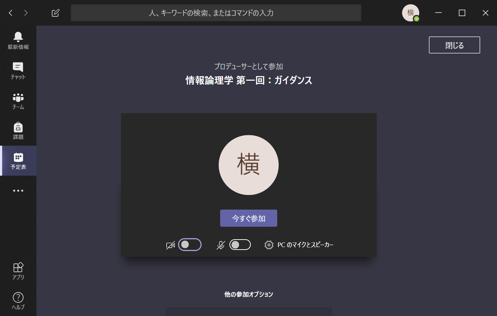

* **これで配信準備完了ですので配信を開始しましょう。配信システムの使い方は色々なサイトで解説がなされていると思います。**
* **またOBS Studioのような配信ソフトを使って配信する事も可能です。その場合は『アクセス許可』の画面で色々と設定する必要があります。**

## 学生の操作

### 1. Microsoft Teamsアプリをインストール

オンライン講義の受講のみでしたらWebブラウザ版のTeamsでも殆ど問題なくできますが、やはり専用アプリがあった方が使いやすいです。会議参加時にインストールする事もできますが、アタフタしない為にも、予めインストールしておくと良いでしょう。

#### Teams for Windows/Mac/Linux

https://www.microsoft.com/ja-jp/microsoft-365/microsoft-teams/download-app

#### Teams for Android

https://play.google.com/store/apps/details?id=com.microsoft.teams&hl=ja

#### Teams for iPhone/iPad

https://apps.apple.com/jp/app/microsoft-teams/id1113153706

### 2. 招待メールのリンクからチームにサインイン

> ここではPCから操作する事を前提に説明します。スマホでもほぼ同じ操作となります。

* **教員から講義チームへ招待が@ed.tmu.ac.jpのメール宛に送られます**

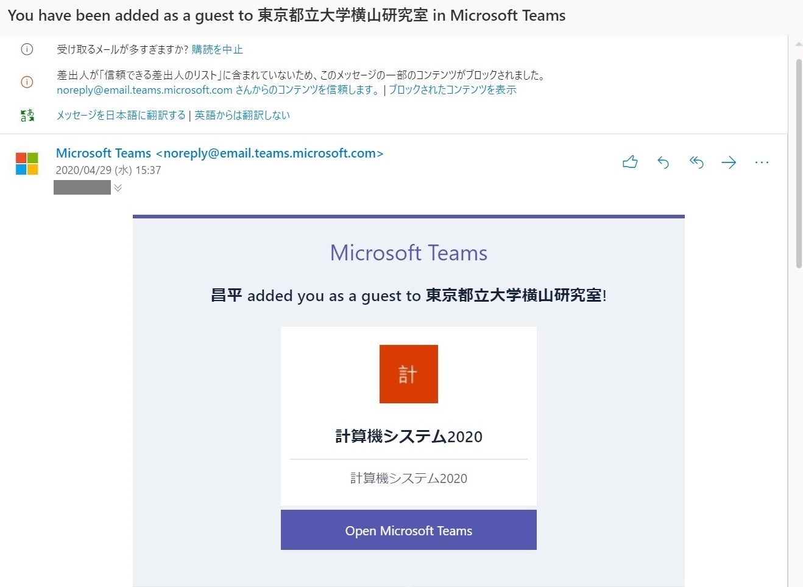

* **上記画面で『Open Teams』をクリックすると、ブラウザが立ち上がり、さらにTeamsアプリを開くかどうかを聞かれますので、アプリを開いてください。**
    * アプリをインストールしていない場合は、Webアプリを利用をクリックするとWebブラウザで操作できます。

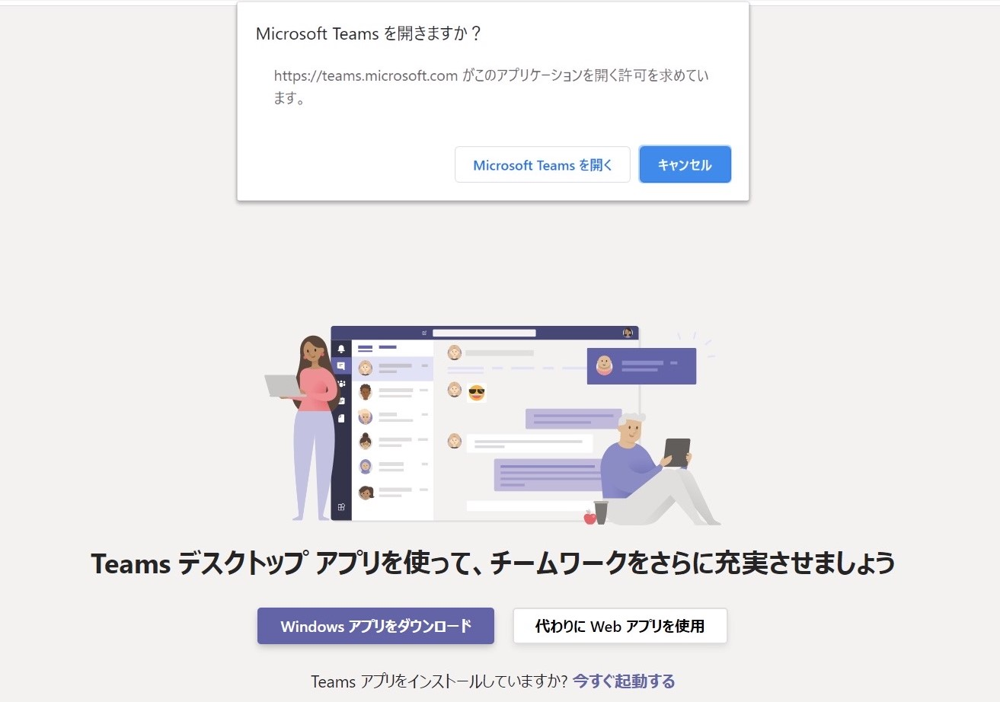

* **Teamsアプリが起動して、サインインアドレスを入力する画面が出てきます。**

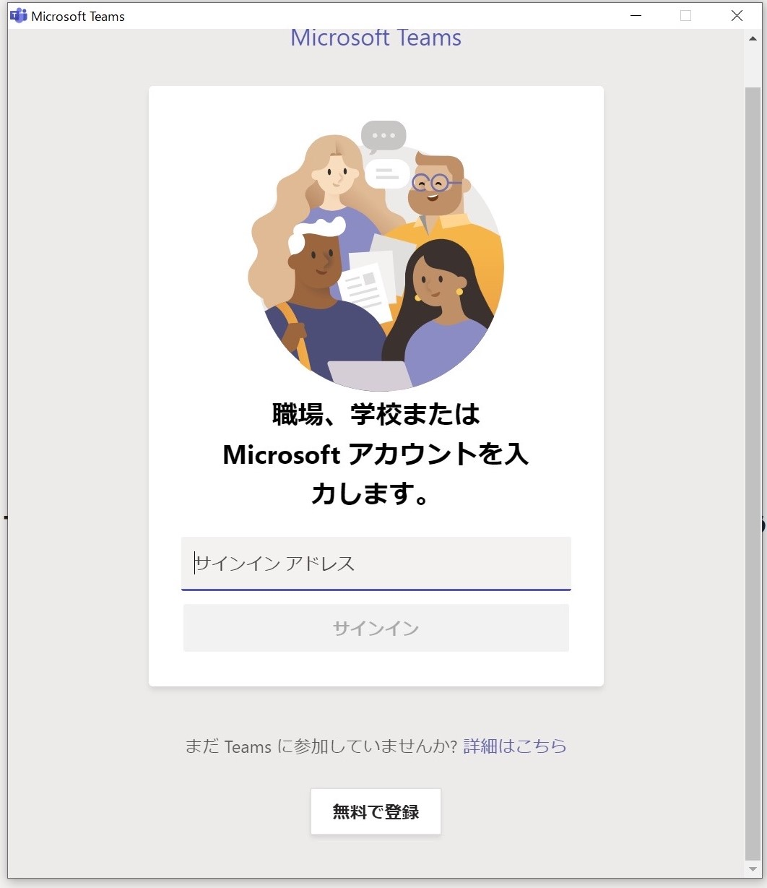

* **ここで、大学からもらっているメールアドレスを入力してください**

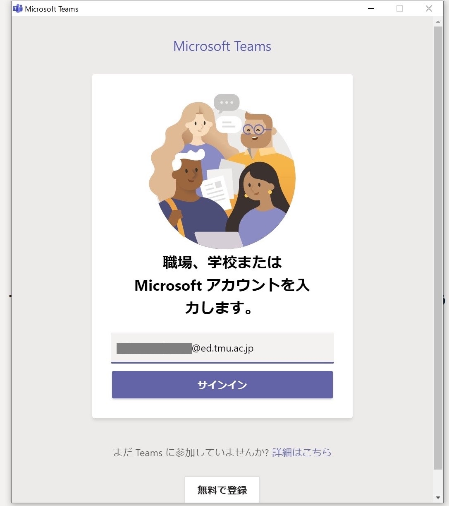

* **そうすると大学のログイン画面に飛ぶので、いつも通りuで始まるユーザIDとそのパスワードを入力してください**

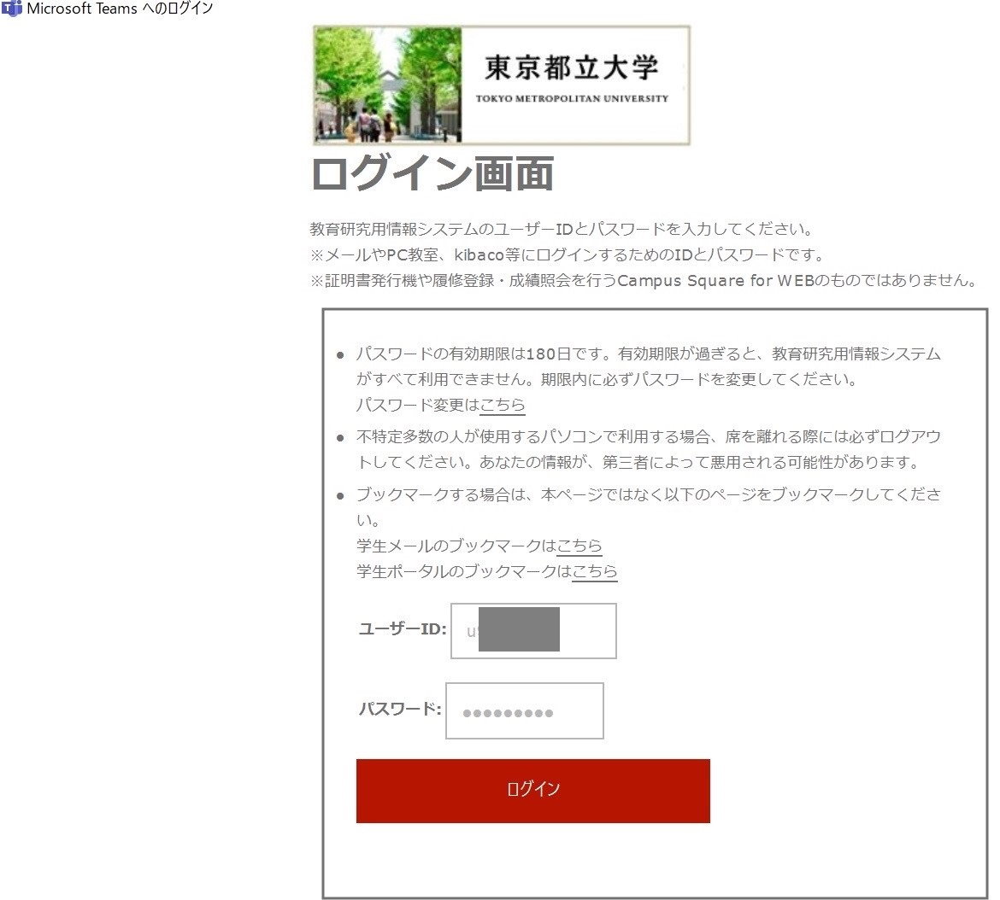

* **サインインが成功するとTeamsのメイン画面が表示されます**

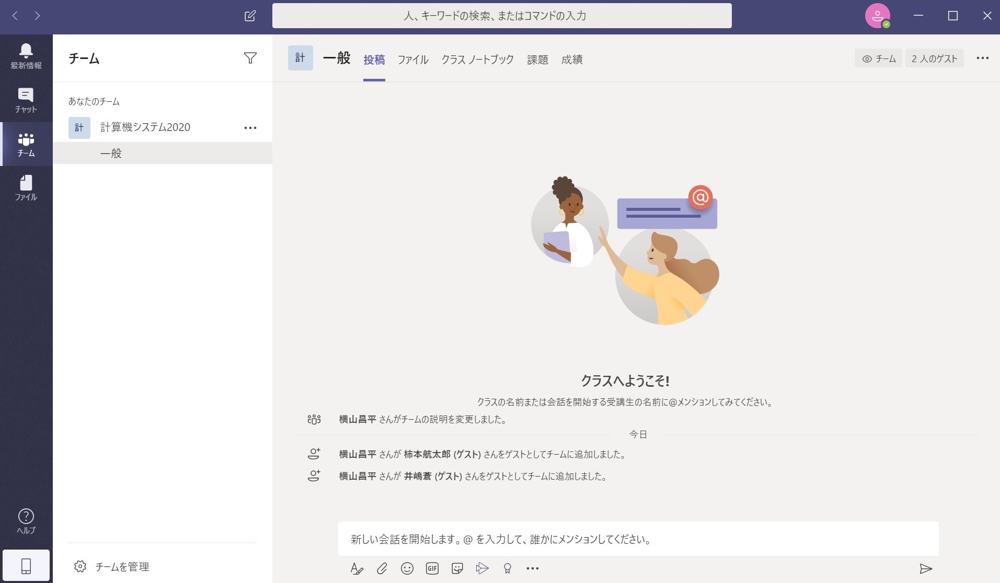

* **Teamsの使い方**
    * Teamsはオンライン会議システムだけでなく、チャットや課題提出システム等様々な役割があります。このメイン画面は基本的にはLineのグループチャットのような機能を持っていますが、それに加えて様々な機能に関する投稿がされます。
    * なお、複数の講義でTeamsを使う場合は、それぞれの講義毎に招待状が送られ、それぞれの講義チームへサインインする必要がありますので注意してください。
    
### 3. オンライン講義の受講

Teamsでの講義を受講する場合、『会議』の機能、あるいは『ライブイベント』の機能で提供されます。前者はLineのような機能、後者はLine Liveのような機能だと考えると良いでしょう。それぞれの参加方法を見ていきます。

#### 3-1. 講義がTeamsの会議で開催される場合

* **講義の予定は、左側サイドバーの『予定表』タブに表示されます**

* **またチームのメイン画面にも会議の投稿がありますので、講義の時間になったら、クリックして、詳細画面から『参加』をクリックして参加してください。**

* **なお、マイクがオンになっていると、自分の家の音が全員に響き渡ってしまいますのでオフにしましょう**
* **カメラもオフにしておかないと、通信量で痛い目を見ます。**

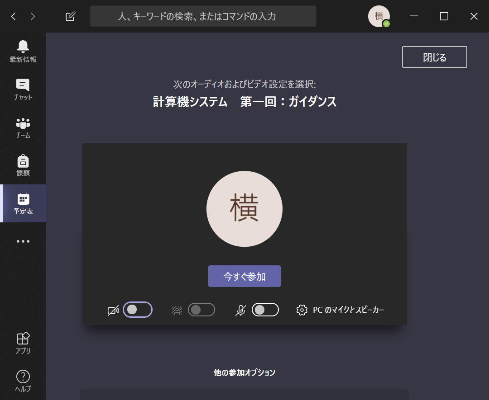

#### 3-2. 講義がTeamsのライブイベントで開催される場合

* **教員からTeamsあるいはkibacoにてライブイベントの参加URLが送られますので、講義時刻になったらクリックしましょう。**

* **いきなりライブ配信を見る画面が出てきます。**
    * 映像・音声を使った双方向性のある会議システムではないのでいきなり視聴画面になりますが、質問やコメント等はテキストチャットを通じて教員に送る事ができます。

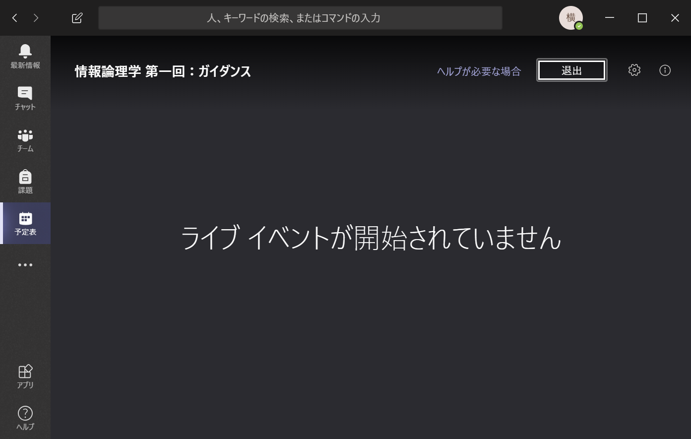
